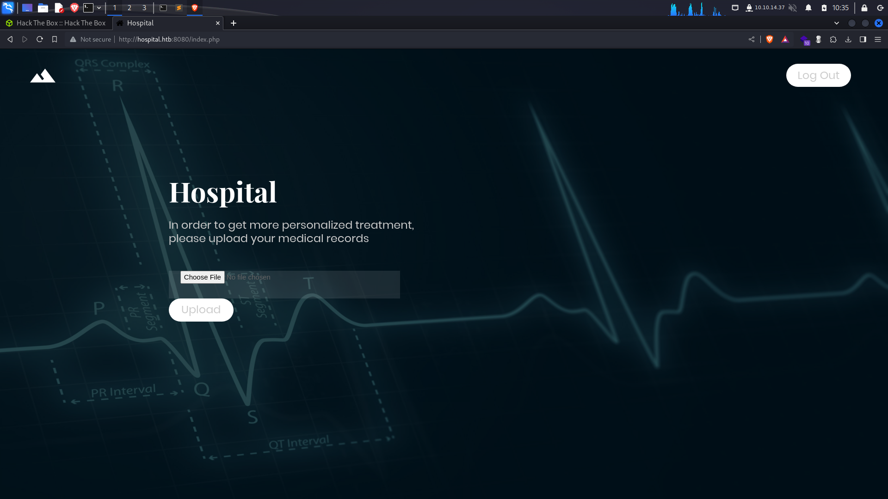
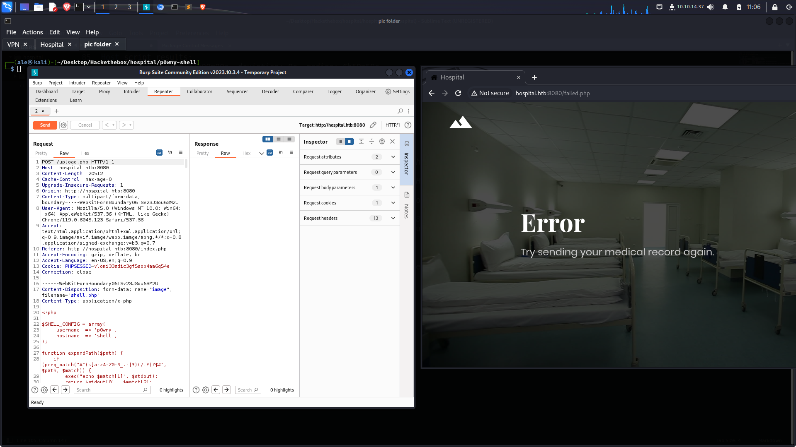
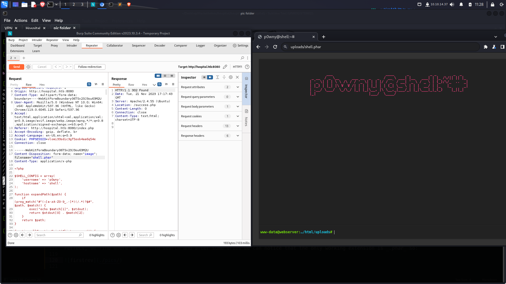
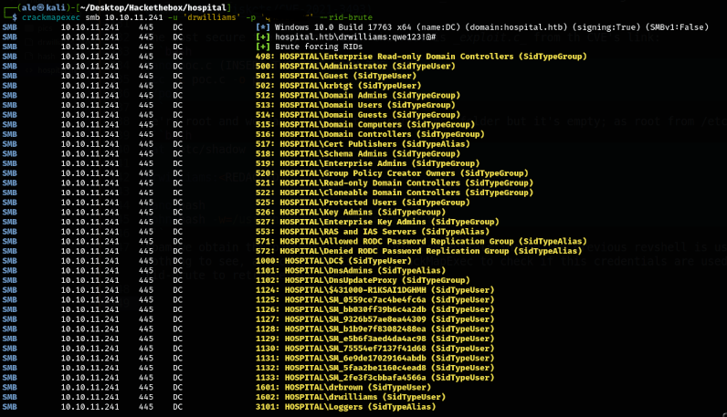
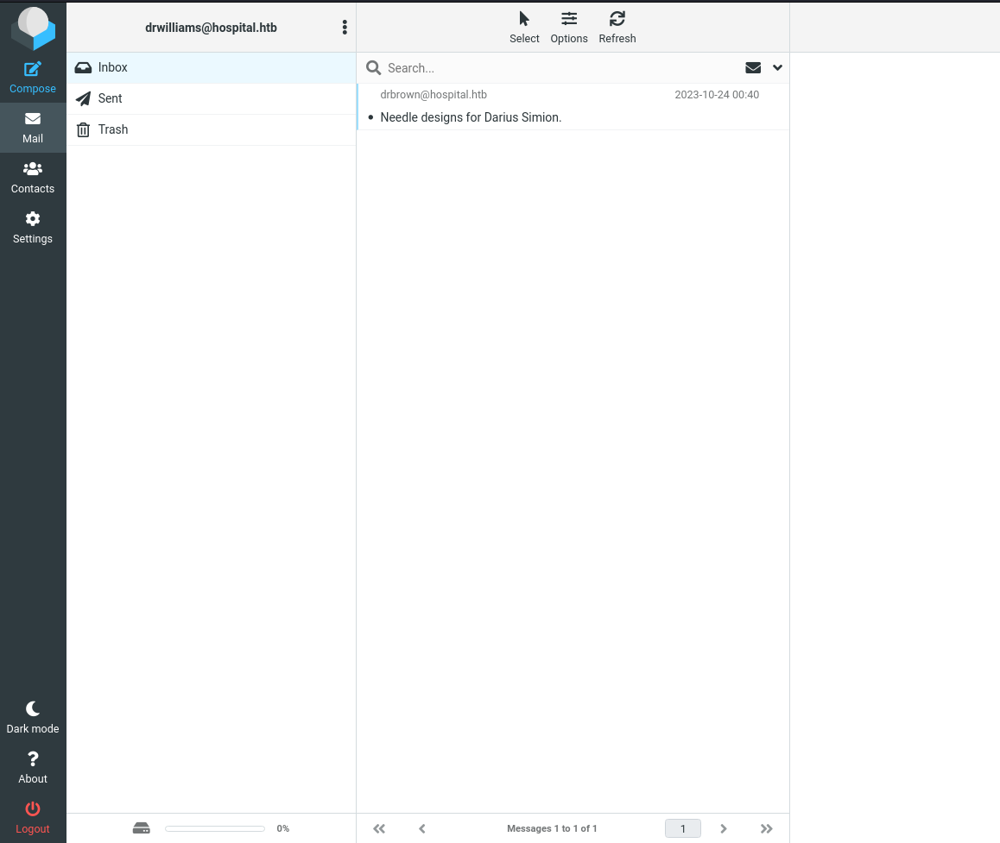
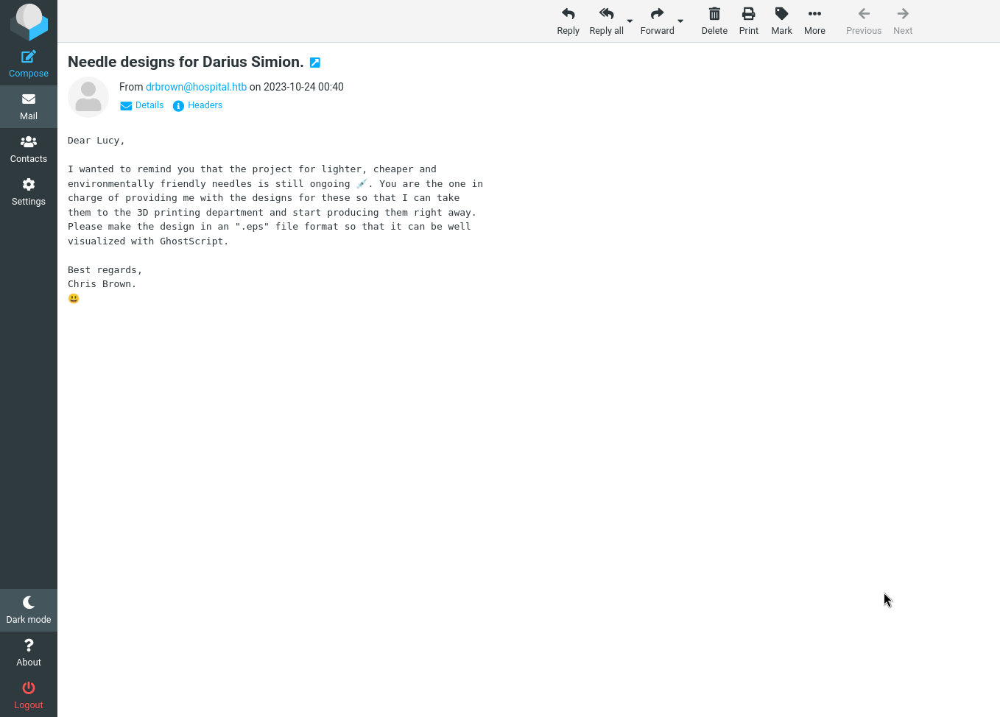
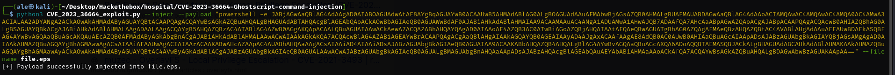

we start the port enumeration with nmap:
```bash
nmap -sC -sV -p- -Pn --min-rate=2000 10.10.11.241

PORT     STATE SERVICE           VERSION
22/tcp   open  ssh               OpenSSH 9.0p1 Ubuntu 1ubuntu8.5 (Ubuntu Linux; protocol 2.0)
| ssh-hostkey: 
|   256 e1:4b:4b:3a:6d:18:66:69:39:f7:aa:74:b3:16:0a:aa (ECDSA)
|_  256 96:c1:dc:d8:97:20:95:e7:01:5f:20:a2:43:61:cb:ca (ED25519)
53/tcp   open  domain            Simple DNS Plus
88/tcp   open  kerberos-sec      Microsoft Windows Kerberos (server time: 2023-11-21 15:55:53Z)
135/tcp  open  msrpc             Microsoft Windows RPC
139/tcp  open  netbios-ssn       Microsoft Windows netbios-ssn
389/tcp  open  ldap              Microsoft Windows Active Directory LDAP (Domain: hospital.htb0., Site: Default-First-Site-Name)
| ssl-cert: Subject: commonName=DC
| Subject Alternative Name: DNS:DC, DNS:DC.hospital.htb
| Not valid before: 2023-09-06T10:49:03
|_Not valid after:  2028-09-06T10:49:03
443/tcp  open  ssl/http          Apache httpd 2.4.56 ((Win64) OpenSSL/1.1.1t PHP/8.0.28)
|_http-title: Hospital Webmail :: Welcome to Hospital Webmail
|_ssl-date: TLS randomness does not represent time
| ssl-cert: Subject: commonName=localhost
| Not valid before: 2009-11-10T23:48:47
|_Not valid after:  2019-11-08T23:48:47
|_http-server-header: Apache/2.4.56 (Win64) OpenSSL/1.1.1t PHP/8.0.28
| tls-alpn: 
|_  http/1.1
445/tcp  open  microsoft-ds?
464/tcp  open  kpasswd5?
593/tcp  open  ncacn_http        Microsoft Windows RPC over HTTP 1.0
636/tcp  open  ldapssl?
| ssl-cert: Subject: commonName=DC
| Subject Alternative Name: DNS:DC, DNS:DC.hospital.htb
| Not valid before: 2023-09-06T10:49:03
|_Not valid after:  2028-09-06T10:49:03
1801/tcp open  msmq?
2103/tcp open  msrpc             Microsoft Windows RPC
2105/tcp open  msrpc             Microsoft Windows RPC
2107/tcp open  msrpc             Microsoft Windows RPC
2179/tcp open  vmrdp?
3268/tcp open  ldap              Microsoft Windows Active Directory LDAP (Domain: hospital.htb0., Site: Default-First-Site-Name)
| ssl-cert: Subject: commonName=DC
| Subject Alternative Name: DNS:DC, DNS:DC.hospital.htb
| Not valid before: 2023-09-06T10:49:03
|_Not valid after:  2028-09-06T10:49:03
3269/tcp open  globalcatLDAPssl?
| ssl-cert: Subject: commonName=DC
| Subject Alternative Name: DNS:DC, DNS:DC.hospital.htb
| Not valid before: 2023-09-06T10:49:03
|_Not valid after:  2028-09-06T10:49:03
3389/tcp open  ms-wbt-server     Microsoft Terminal Services
| ssl-cert: Subject: commonName=DC.hospital.htb
| Not valid before: 2023-09-05T18:39:34
|_Not valid after:  2024-03-06T18:39:34
| rdp-ntlm-info: 
|   Target_Name: HOSPITAL
|   NetBIOS_Domain_Name: HOSPITAL
|   NetBIOS_Computer_Name: DC
|   DNS_Domain_Name: hospital.htb
|   DNS_Computer_Name: DC.hospital.htb
|   DNS_Tree_Name: hospital.htb
|   Product_Version: 10.0.17763
|_  System_Time: 2023-11-21T15:56:49+00:00
5985/tcp open  http              Microsoft HTTPAPI httpd 2.0 (SSDP/UPnP)
|_http-server-header: Microsoft-HTTPAPI/2.0
|_http-title: Not Found
6170/tcp open  msrpc             Microsoft Windows RPC
6404/tcp open  msrpc             Microsoft Windows RPC
6406/tcp open  ncacn_http        Microsoft Windows RPC over HTTP 1.0
6407/tcp open  msrpc             Microsoft Windows RPC
6409/tcp open  msrpc             Microsoft Windows RPC
6613/tcp open  msrpc             Microsoft Windows RPC
8080/tcp open  http              Apache httpd 2.4.55 ((Ubuntu))
| http-cookie-flags: 
|   /: 
|     PHPSESSID: 
|_      httponly flag not set
|_http-server-header: Apache/2.4.55 (Ubuntu)
|_http-open-proxy: Proxy might be redirecting requests
| http-title: Login
|_Requested resource was login.php
9389/tcp open  mc-nmf            .NET Message Framing
Service Info: Host: DC; OSs: Linux, Windows; CPE: cpe:/o:linux:linux_kernel, cpe:/o:microsoft:windows

Host script results:
|_clock-skew: mean: 7h00m00s, deviation: 0s, median: 6h59m59s
| smb2-security-mode: 
|   3:1:1: 
|_    Message signing enabled and required
| smb2-time: 
|   date: 2023-11-21T15:56:52
|_  start_date: N/A
```
The output above tell us some interesting things:

1) Several domain names: _HOSPITAL_, _hospital.htb_ and _DC.hospital.htb_ to add at _/etc/hosts_

2) Interesting services: _SMB (139, ...)_, _LDAP (3268, ...)_, _HTTPS (443)_ e _HTTP (8080)_

The only way to do something is the _HTTP_ because _SMB_ and _LDAP_ doesn't allow the null connection meanwhile the _HTTPS_ it'seems untochable<br>
we're able to continue with the following URL _http://hospital.htb:8080/_, we don't have any credentials but below the login form there is a blue button called _Make One_, we click on it and a very beautiful thing appear:



we open _Burpsuite_ and try to upload a revshell, We can use this [one](https://github.com/flozz/p0wny-shell) more specific it's called _shell.php_

Output:
 

It seems there is a check for the extensions file, we can try some fuzzing in the _filename_ field by adding some several extensions, we can try some from the [Hacktricks](https://book.hacktricks.xyz/pentesting-web/file-upload) more specific theese one _.php, .php2, .php3, .php4, .php5, .php6, .php7, .phps, .phps, .pht, .phtm, .phtml, .pgif, .shtml, .htaccess, .phar, .inc, .hphp, .ctp, .module_.<br>

First to bypass the upload check we must know where the file could be uploaded, it's time to use gobuster:
```bash
gobuster dir -u http://hospital.htb:8080/  -w /usr/share/wordlists/dirbuster/directory-list-2.3-medium.txt -x php,js,txt,html,old,docx 
/uploads              (Status: 301) [Size: 321] [--> http://hospital.htb:8080/uploads/]
/upload.php           (Status: 200) [Size: 0]
```
Perfect, we find where we want to search and after some tries we can notice that the only working extension is _.phar_ so:



Beware that there is a cronjob who it removes our revshell to resolve this problem is enough to relaunch another revshell<br>

We can search inside the filesystem and try some enumerations to retrieve some informations:

1) _/etc/passwd_ reveals another user called _"drwilliams"_

2) _config.php_ has some credentials for the mariadb but there isn't anything of our interest

3) _uname -a_ tells us the ubuntu's version _Linux webserver 5.19.0-35-generic #36-Ubuntu_ and it seems affected by this [CVE](https://github.com/briskets/CVE-2021-3493)

The most secure the way to obtain the root is _exploit.c_ from th CVE's link:
```bash
nano poc.c (INSERT THE CODE FROM THE CVE)
gcc -c poc.c -o poc 
./poc
```
we're root and we can navigate to _drwilliams_ folder but it's empty; as root from /etc/shadow we can read drwilliams' hash and crack it:
```bash
cat /etc/shadow

drwilliams:<REDACTED>:::

nano hash
john hash -w=/usr/share/wordlists/rockyou.txt
```
sbam we obtain the password; so use this credentials inside the previous revshell is useless beause we're already root and there isn't<br> nothing to see, a second way is used CrackMapExec to check if this credentials are used inside the windows target and furthermore a<br> rid-brute to retrieve all users:

 

okay we retieve another user called _drbrown_ and the credentials are valid but we can't logon with the typical access (_SSH, WinRM..._)<br> but if we rembember it was a _HTTPS_ webserver with a form login therefore we can try to access with drwilliams' credentials

 

Inside we can see that there is an email from _drbrown_ called _Needle designs for Darius Simion_



Two interesting words _.eps_ and _Ghostscript_ by a simple search like _revshell .eps ghostscript poc_ at the first [link](https://github.com/jakabakos/CVE-2023-36664-Ghostscript-command-injection):



we go to compose, fill the various fields attach the _file.eps_ open a listener and we gain access to the target machine and retrieve the user flag.<br>

After some time to search inside the filesystem we can see _xampp_ folder by this command:

```powershell
icalcs .\xampp
```

we have the right permission on it and the owner's folder is _SYSTEM_, so by adding a revshell and navigate to it, we can retrieve the root.flag.